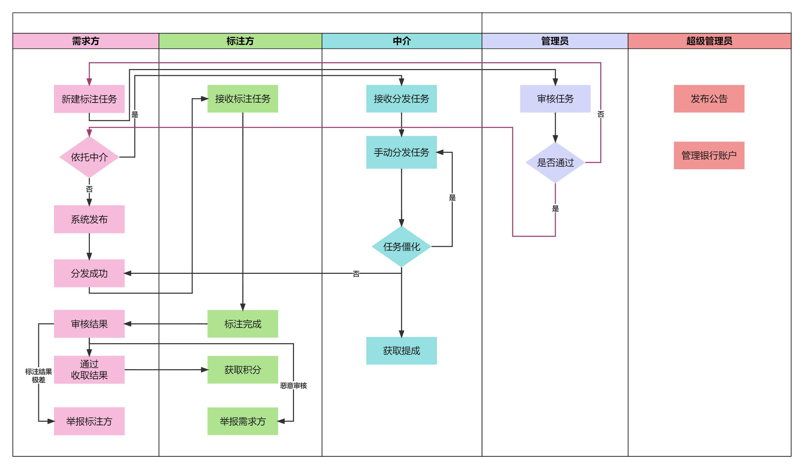

### 需求概述

- 用户相关
  - 基本操作
    - 用户注册，对密码规范性进行检测，可以绑定邮箱
    - 用户登录
    - 用户登出
    - 修改密码，通过邮箱验证码进行验证
    - 获取标注方排行榜
  - 管理员操作
    - 超级管理员
      - 查看当前所有管理员的信息
      - 审核管理员资格
      - 发布/修改/删除公告
    - 管理员
      - 查看当前所有普通用户的信息
      - 审核需求方资格
      - 封禁/解封普通用户
  - 账户模块
    - 超管支持新增/修改/删除银行卡
    - 普通用户输入卡号和密码绑定银行卡
    - 普通用户将卡内余额充值到积分账户
    - 普通用户将积分提现至银行账户
  - 举报模块
    - 普通用户就任务结果有异议时可互相举报
    - 管理员查看并处理举报，可通过或驳回
    - 普通用户可获取与自己相关的举报
    - 平台对举报结果进行通知
- 任务相关
  - 需求方
    - 创建/修改/发布/删除任务
      - 支持多种任务类型：文本标注、图片标注、语音标注、视频标注、图片框选、骨骼打点、内容审核、实体三元组标注
      - 可规定任务时限、分发的信用分下限、分发方式等
    - 充值会员，提高任务上传速度
    - 查看当前已发布的任务
    - 查看一个任务的详情
    - 修改任务分发的信用分限制
    - 刷新任务分发对象
    - 审核标注方的标注结果，选择接收或拒绝此标注方的标注结果
  - 标注方
    - 获取当前被分配到的任务
    - 选择接受/拒绝任务
    - 在线标注任务
    - 修改/保存标注结果
    - 下载任务数据
    - excel批量标注
    - 查看当前标注进度
  - 管理员
    - 查看当前所有任务或单个任务详情
    - 审核已发布的任务
  - 中介
    - 查看当前委托给中介的任务
    - 接受任务分发委托
    - 查看任务详情
    - 查看标注方并进行任务分配

### 需求用例

